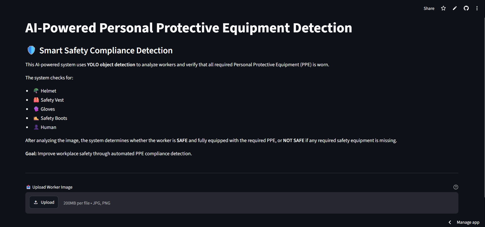
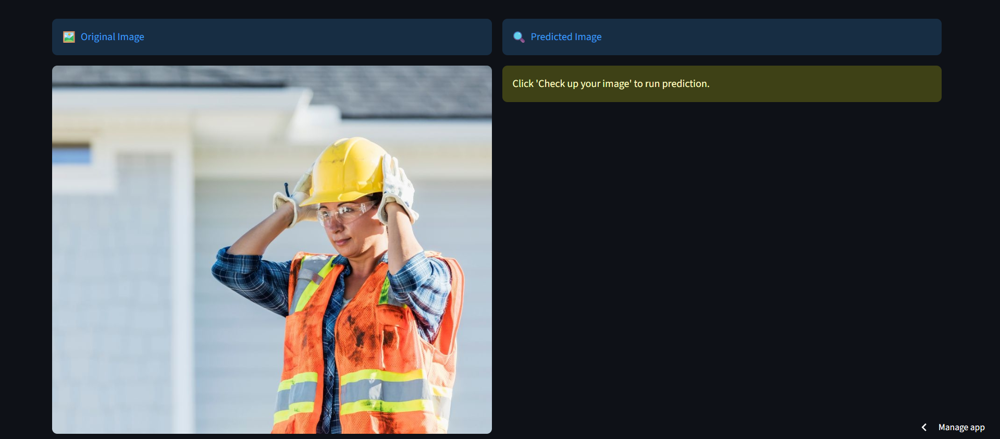
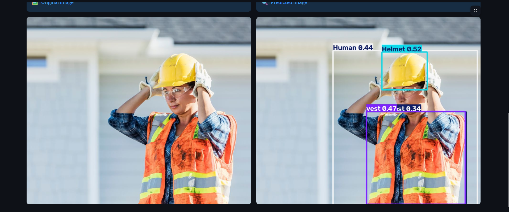

# 🛡️ AI-Powered Personal Protective Equipment (PPE) Detection

An end-to-end computer vision web application that automatically checks whether construction / industrial workers are wearing the required **Personal Protective Equipment (PPE)**, using a custom-trained **YOLO** object detection model deployed with **Streamlit**.

<p align="center">
  <a href="https://ppe-detection-app-fphysemvpx9vbezmpggbdc.streamlit.app/">
    
  </a>
  
  
  
</p>

<p align="center">
  <b>🔗 Live App:</b> <a href="https://ppe-detection-app-fphysemvpx9vbezmpggbdc.streamlit.app/">ppe-detection-app-fphysemvpx9vbezmpggbdc.streamlit.app</a>
</p>

---

## 📖 Overview

Workplace accidents are often caused by workers not wearing proper safety gear. This project automates PPE compliance monitoring by analyzing an uploaded worker image and instantly reporting whether the worker is **✅ SAFE** (fully equipped) or **❌ NOT SAFE** (missing required equipment).

The system detects:

| Icon | Class |
|---|---|
| 🪖 | Helmet |
| 🦺 | Safety Vest |
| 🧤 | Gloves |
| 🥾 | Safety Boots |
| 👤 | Human (person detection) |

**Goal:** Improve on-site safety compliance through automated, real-time visual inspection — reducing the need for manual supervision.

---

## 🖥️ Demo / Screenshots

**Home Page**



**Upload an Image**



**Detection Result — Bounding Boxes + Confidence Scores**



> The right panel shows the model's predictions with bounding boxes and confidence scores overlaid on the original image, so the user can visually verify what the model detected.

---

## 🏗️ System Architecture

The project follows a full ML pipeline, from raw annotated data to a deployed interactive app:

```
Roboflow Dataset (Construction PPE, v2)
            ⬇
   YOLO Model Training (Ultralytics)
            ⬇
 Trained Weights Hosted on Hugging Face Hub
            ⬇
   Streamlit App (app.py) loads the model
            ⬇
   User Uploads Image → Inference → Annotated Result
```

---

## 📊 Dataset

- **Source:** [Roboflow Universe — Construction PPE Dataset](https://universe.roboflow.com/skcet-g4h72/construction-ppe-rdhzo) (Version 2)
- **Size:** ~8,845 annotated images
- **License:** CC BY 4.0
- **Classes include:** Helmet, Safety Vest, Gloves, Safety Boots, Human, Glasses, plus their "missing equipment" counterparts (e.g. `no-helmet`, `no-vest`, `no-gloves`, `no-boots`) — 16 classes total in the source dataset.
- **Format used for training:** YOLO format, downloaded directly via the Roboflow Python SDK.

The dataset was downloaded and split (train/val/test) automatically through Roboflow before training.

---

## 🧠 Model Training

The model was fine-tuned using **Ultralytics YOLO** on the Roboflow dataset described above. Key training configuration (from the training notebook):

| Parameter | Value |
|---|---|
| Base task | Object Detection (transfer learning from a pretrained checkpoint) |
| Epochs | 30 |
| Image size | 640×640 |
| Batch size | 16 |
| Optimizer | AdamW |
| Initial learning rate | 0.001 |
| Early stopping patience | 20 |
| Cosine LR scheduler | Enabled (`cos_lr=True`) |
| Mixed precision (AMP) | Enabled |
| Close mosaic (last epochs) | 10 |
| Seed | 42 |

```python
history = model.train(
    data="Construction-PPE-2/data.yaml",
    epochs=30,
    imgsz=640,
    batch=16,
    patience=20,
    optimizer="AdamW",
    lr0=0.001,
    close_mosaic=10,
    cos_lr=True,
    amp=True,
    workers=8,
    val=True,
    plots=True,
    seed=42,
    save=True
)
```

The final trained weights (`PPE_Complex_Model.pt`) are hosted on the **Hugging Face Hub** (`abdollah111/ppe-detection-model`) and downloaded automatically by the app at runtime via `huggingface_hub.hf_hub_download`.

> 📌 **Note:** For exact final validation metrics (mAP, Precision, Recall) of this fine-tuned model, add the results table generated by Ultralytics after training (`results.csv` / `results.png`) here once available.

---

## ⚙️ Tech Stack

| Layer | Tools |
|---|---|
| Model | YOLO (Ultralytics) |
| Training | Google Colab, Roboflow SDK |
| Model Hosting | Hugging Face Hub |
| Web App | Streamlit |
| Image Processing | OpenCV, Pillow, NumPy |
| Deployment | Streamlit Community Cloud |

---

## 🚀 Getting Started

### Prerequisites
- Python 3.10+
- pip

### Installation

```bash
# 1. Clone the repository
git clone https://github.com/abdollahDraz/PPE-Detection-Streamlit.git
cd PPE-Detection-Streamlit

# 2. Install dependencies
pip install -r requirements.txt

# 3. Run the app
streamlit run app.py
```

The app will open automatically in your browser at `http://localhost:8501`.

### Usage
1. Upload a worker image (`.jpg`, `.jpeg`, `.png`).
2. Click **"🔍 Check up your image"**.
3. View the annotated result with detected PPE classes and confidence scores.
4. The app flags the worker as **SAFE** or **NOT SAFE** based on the required PPE checklist.

---

## 📁 Project Structure

```
PPE-Detection-Streamlit/
├── app.py                # Streamlit application (UI + inference logic)
├── requirements.txt      # Python dependencies
└── README.md             # Project documentation
```

---

## 🔮 Future Improvements

- [ ] Add real-time detection via webcam / video stream
- [ ] Support multi-person detection with individual compliance status per person
- [ ] Display per-class confidence threshold controls in the UI
- [ ] Add downloadable compliance report (PDF/CSV)
- [ ] Deploy an inference API (FastAPI) alongside the Streamlit UI
- [ ] Publish training metrics (mAP, Precision/Recall curves) in this README

---

## 👤 Author

**Abdollah Draz**
- GitHub: [@abdollahDraz](https://github.com/abdollahDraz)
- Model on Hugging Face: [abdollah111/ppe-detection-model](https://huggingface.co/abdollah111/ppe-detection-model)

---

## 📄 License

The dataset used is licensed under **CC BY 4.0** ([Roboflow Universe — Construction PPE Dataset](https://universe.roboflow.com/skcet-g4h72/construction-ppe-rdhzo)). Please attribute accordingly if you reuse the dataset or model in research or production.
